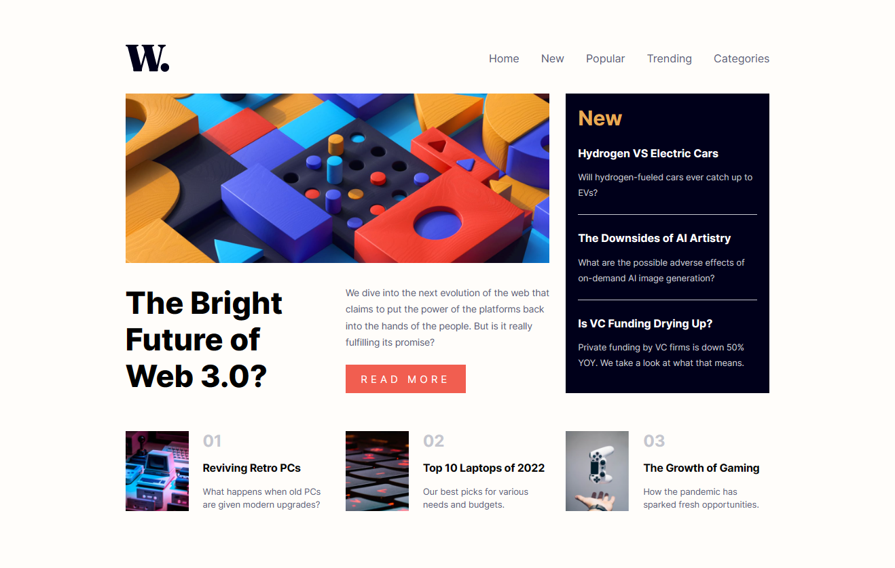

# Frontend Mentor - News homepage solution

This is a solution to the [News homepage challenge on Frontend Mentor](https://www.frontendmentor.io/challenges/news-homepage-H6SWTa1MFl). Frontend Mentor challenges help you improve your coding skills by building realistic projects.

## Table of contents

-   [Overview](#overview)
    -   [The challenge](#the-challenge)
    -   [Screenshot](#screenshot)
    -   [Links](#links)
-   [My process](#my-process)
    -   [Built with](#built-with)
    -   [What I learned](#what-i-learned)
-   [Author](#author)

## Overview

### The challenge

Users should be able to:

-   View the optimal layout for the interface depending on their device's screen size
-   See hover and focus states for all interactive elements on the page

### Screenshot



### Links

-   Solution URL: [Add solution URL here](https://your-solution-url.com)
-   Live Site URL: [Add live site URL here](https://your-live-site-url.com)

## My process

### Built with

-   Semantic HTML5 markup
-   CSS custom properties
-   Flexbox
-   CSS Grid
-   Mobile-first workflow

### What I learned

```html
<picture>
	<source media="(max-width: 600px)" srcset="./assets/images/image-web-3-mobile.jpg" />
	<source srcset="./assets/images/image-web-3-desktop.jpg" />
	
</picture>
```

```css
:root {
	--soft-orange: hsl(35, 77%, 62%);
	--soft-red: hsl(5, 85%, 63%);
	--off-white: hsl(36, 100%, 99%);
	--grayish-blue: hsl(233, 8%, 79%);
	--dark-grayish-blue: hsl(236, 13%, 42%);
	--very-dark-blue: hsl(240, 100%, 5%);
}
```

```js
const offcanvas = document.querySelector(".transparent-canvas");
const menu = document.querySelector(".navbar-links");
const mainbody = document.querySelector("body");

function openMenu() {
	offcanvas.classList.add("transparent-canvas-show");
	menu.classList.add("navbar-links-show");
	mainbody.style.position = "fixed";
}

function closeMenu() {
	offcanvas.classList.remove("transparent-canvas-show");
	menu.classList.remove("navbar-links-show");
	mainbody.style.position = "static";
}
```

## Author

-   Website - [Add your name here](https://www.your-site.com)
-   Frontend Mentor - [@yourusername](https://www.frontendmentor.io/profile/yourusername)
-   Twitter - [@yourusername](https://www.twitter.com/yourusername)
